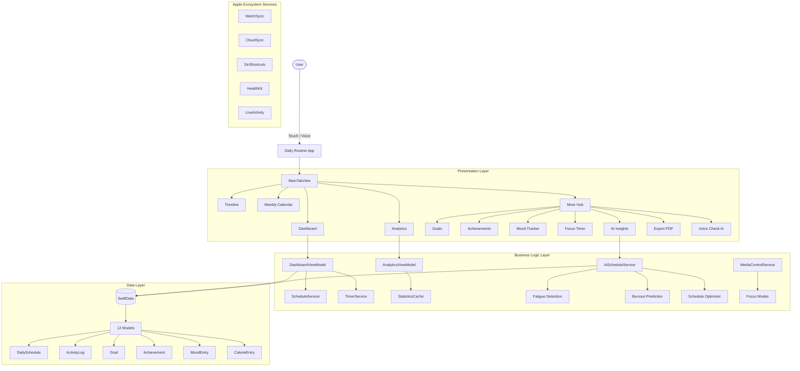
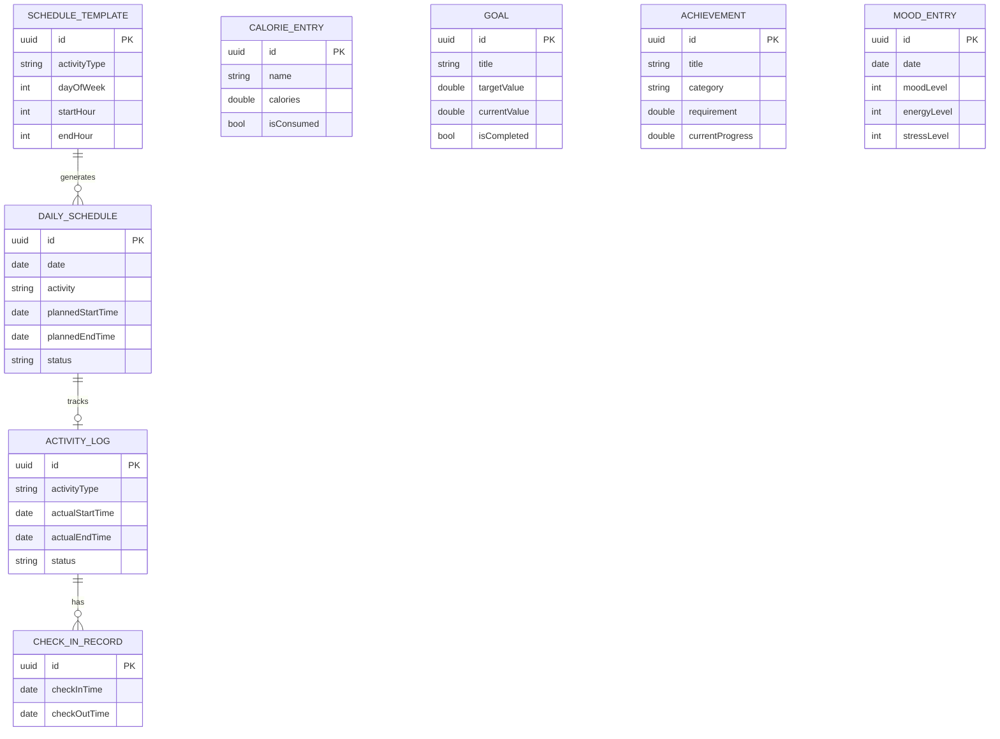
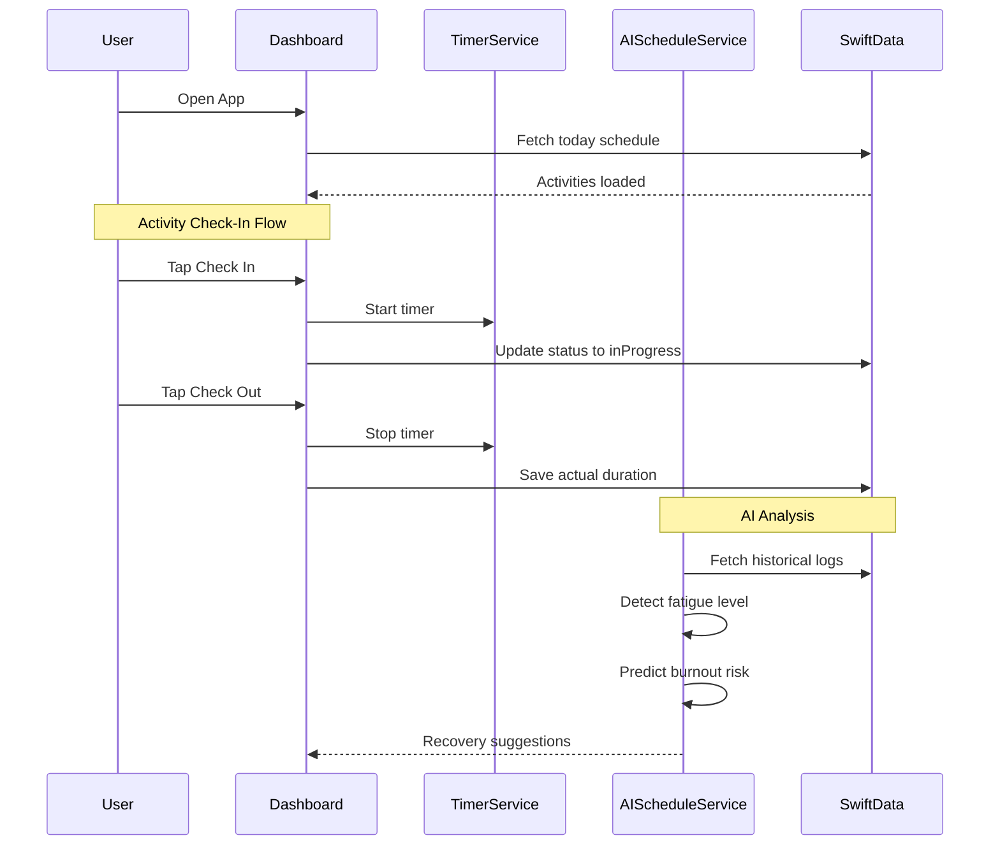

<h1 align="center">Daily Routine</h1>

<p align="center">
  A professional iOS productivity app for personal schedule management, activity tracking, and AI-powered wellness monitoring.
</p>

<p align="center">
  
  
  
  
  
  
</p>

---

Daily Routine is a comprehensive daily life management platform built with SwiftUI and SwiftData, designed to optimize personal productivity through intelligent scheduling, real-time activity tracking, and AI-powered wellness insights.

- Flexible management of daily/weekly/monthly schedules with conflict detection and dynamic CRUD.
- Real-time activity check-in/check-out with timer tracking, pause/resume, and evidence capture.
- AI-Powered Insights: Fatigue detection, burnout prediction, and adaptive schedule optimization.
- Productivity tools: Pomodoro focus timer, goal tracking, achievement badges, mood tracking.
- Multi-Language: English, Vietnamese, Chinese with localized notifications.

<h2 align="center">Key Features</h2>

```
120 features across 15 categories
```

```
12 SwiftData models with offline-first persistence
```

```
7 AI-powered analysis algorithms
```

```
3 languages (EN / VI / ZH-Hans)
```

<h2 align="center">System Architecture</h2>



<h2 align="center">Database Design</h2>



<h2 align="center">User Workflow</h2>



<h2 align="center">Getting Started</h2>

### 1. Prerequisites
- macOS 14+ (Sonoma)
- Xcode 15+
- XcodeGen (`brew install xcodegen`)
- iOS 17+ device or Simulator

### 2. Installation

```bash
# Clone the repository
git clone https://github.com/MrPhuocTan/daily-routine.git
cd daily-routine

# Generate Xcode project and open
xcodegen generate
open DailyRoutine.xcodeproj
```

The app will run on iOS Simulator or a connected device via Xcode.

```
Select your device -> Run (Cmd+R)
```

<h2 align="center">Support & Contact</h2>

For inquiries, feedback, or collaboration opportunities, contact the developer.

Author & Credits: MrPhuocTan - [phtan.working@gmail.com](mailto:phtan.working@gmail.com) - 097.201.2901

Daily Routine - (c) 2026 MrPhuocTan. All rights reserved.
