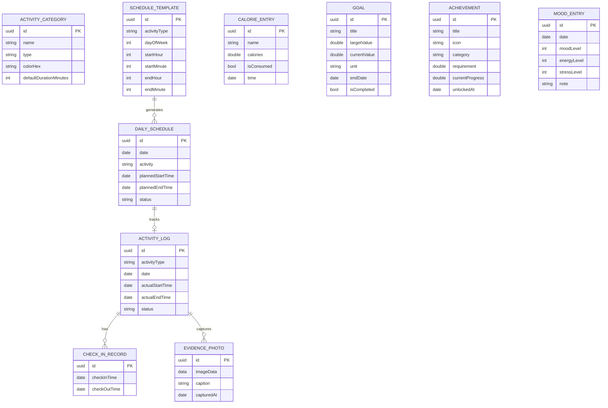
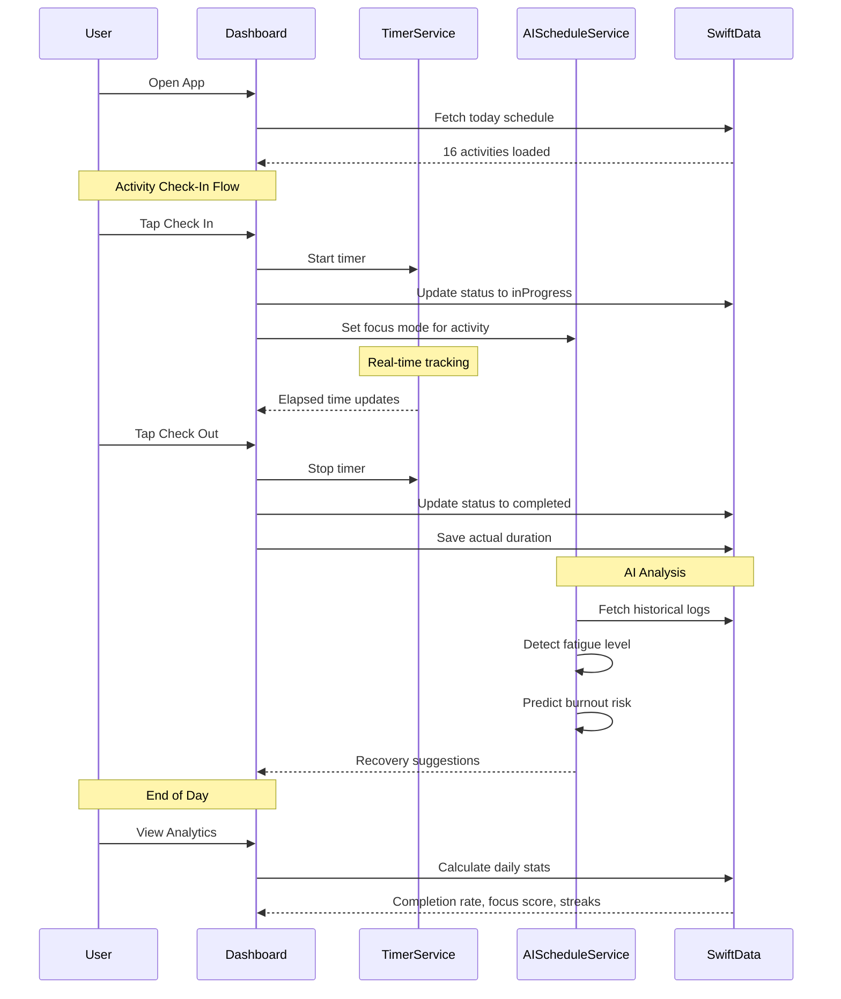

<h1 align="center">Daily Routine</h1>

<p align="center">
  A professional, feature-rich iOS productivity app for personal schedule management, activity tracking, and intelligent wellness monitoring.
</p>

<p align="center">
  
  
  
  
  
  
  
  
</p>

---

Daily Routine is a comprehensive daily life management platform designed to optimize personal productivity through intelligent scheduling, real-time activity tracking, and AI-powered wellness insights.

- Flexible management of daily/weekly/monthly schedules via an intuitive SwiftUI interface.
- Real-time activity check-in/check-out with timer tracking and evidence capture.
- AI-Powered Insights: Fatigue detection, burnout prediction, and adaptive schedule optimization using local heuristic intelligence.
- Multi-Language Support: Full localization in English, Vietnamese, and Chinese.

<h2 align="center">Key Features</h2>

```
120 Features
```

```
15 Categories
```

```
12 SwiftData Models
```

```
128 Unit Tests
```

```
3 Languages
```

```
9,597 Lines of Code
```

<h2 align="center">Core Features</h2>

| Category | Features | Description |
|----------|:--------:|-------------|
| Core Schedule | 8 | Daily timeline, weekly/monthly views, conflict detection, dynamic CRUD |
| Activity Tracking | 10 | Check-in/out, pause/resume, actual vs planned, streaks |
| Analytics & Reports | 10 | Daily/weekly/monthly stats, heatmaps, burnout risk, focus score |
| Goals & Achievements | 8 | Goal CRUD with progress tracking, 15 achievement badges |
| AI & Smart Features | 7 | Schedule optimization, fatigue detection, burnout prediction |
| Media & Focus | 9 | Focus timer (Pomodoro), Apple Music integration, activity-based modes |
| Calorie Tracking | 9 | Full consumed/burned CRUD, daily/weekly/monthly summaries |
| Evidence Gallery | 5 | Camera capture, photo accountability, date-grouped gallery |
| Mood Tracking | 3 | Daily mood/energy/stress with trends and visualization |
| Voice Check-In | 1 | Speech recognition with fuzzy activity matching |
| Export Reports | 1 | PDF generation with activity/calorie summaries and share sheet |
| Apple Ecosystem | 10 | Watch, iCloud, Siri, Focus, Calendar, HealthKit service layers |
| Dynamic Island | 5 | Live Activity service layer (ActivityKit ready) |
| Multi-language | 6 | EN/VI/ZH-Hans, localized notifications, dynamic switching |
| Database | 8 | SwiftData, offline-first, MVVM, scalable schema |

<h2 align="center">System Architecture</h2>


<h2 align="center">Database Design</h2>



<h2 align="center">User Workflow</h2>



<h2 align="center">Tech Stack</h2>

| Layer | Technology |
|-------|-----------|
| UI Framework | SwiftUI (iOS 17+) |
| Architecture | MVVM |
| Database | SwiftData (offline-first) |
| AI Engine | Local heuristic algorithms |
| Media | MediaPlayer framework |
| Speech | Speech framework |
| PDF | UIGraphicsPDFRenderer |
| Build System | XcodeGen + Xcode 15+ |
| Testing | XCTest (128 tests) |
| Localization | EN / VI / ZH-Hans |

<h2 align="center">Test Results</h2>

```
128 tests -- 0 failures -- 0.573s
```

| Suite | Tests | Coverage |
|-------|:-----:|----------|
| FrontendTests | 19 | View data, theme, navigation, rendering |
| BackendTests | 18 | Services, ViewModels, timer, localization |
| UIUXTests | 24 | Activity types, categories, date formatting |
| DatabaseTests | 24 | SwiftData CRUD, relationships, seeder |
| WorkflowTests | 8 | E2E check-in/out, calorie tracking, settings |
| LogicTests | 35 | Duration math, AI algorithms, goal logic |

<h2 align="center">Getting Started</h2>

### 1. Prerequisites
- macOS 14+ (Sonoma)
- Xcode 15+
- XcodeGen (`brew install xcodegen`)
- iOS 17+ device or Simulator

### 2. Installation

```bash
# Clone the repository
git clone https://github.com/MrPhuocTan/daily-routine.git
cd daily-routine

# Generate Xcode project
xcodegen generate

# Open in Xcode
open DailyRoutine.xcodeproj
```

### 3. Build & Run

```bash
# Build for simulator
xcodebuild -project DailyRoutine.xcodeproj \
    -scheme DailyRoutine \
    -destination 'platform=iOS Simulator,name=iPhone 17 Pro' \
    build

# Run tests
xcodebuild test -project DailyRoutine.xcodeproj \
    -scheme DailyRoutine \
    -destination 'platform=iOS Simulator,name=iPhone 17 Pro'
```

### 4. Deploy to Device

Connect your iPhone via USB, then:

```bash
# In Xcode: Select your device -> Run (Cmd+R)
# First time: Settings -> General -> VPN & Device Management -> Trust
```

<h2 align="center">Project Structure</h2>

```
daily-routine/
├── DailyRoutineApp.swift          # App entry point + SwiftData container
├── Models/                        # 12 SwiftData models
│   ├── DailySchedule.swift
│   ├── ActivityLog.swift
│   ├── Goal.swift
│   ├── Achievement.swift
│   ├── MoodEntry.swift
│   └── ...
├── Views/                         # 30 SwiftUI views
│   ├── Dashboard/
│   ├── Timeline/
│   ├── Weekly/
│   ├── Analytics/
│   ├── Goals/
│   ├── Achievements/
│   ├── Mood/
│   ├── AI/
│   ├── Focus/
│   ├── Export/
│   ├── Voice/
│   └── ...
├── ViewModels/                    # 7 ViewModels (MVVM)
├── Services/                      # 8 Services
│   ├── ScheduleService.swift
│   ├── TimerService.swift
│   ├── AIScheduleService.swift
│   ├── MediaControlService.swift
│   ├── AppleEcosystemServices.swift
│   └── ...
├── Utilities/                     # Extensions, constants, helpers
└── Localization/                  # EN / VI / ZH-Hans
```

<h2 align="center">Support & Contact</h2>

For inquiries, feedback, or collaboration opportunities, contact the developer.

Author & Credits: MrPhuocTan - [phtan.working@gmail.com](mailto:phtan.working@gmail.com) - 097.201.2901

Daily Routine - (c) 2026 MrPhuocTan. All rights reserved.
